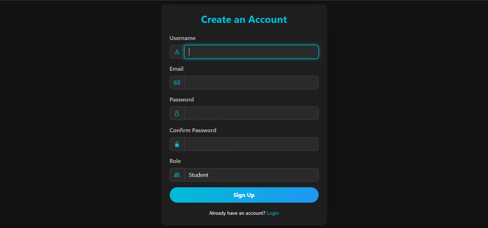
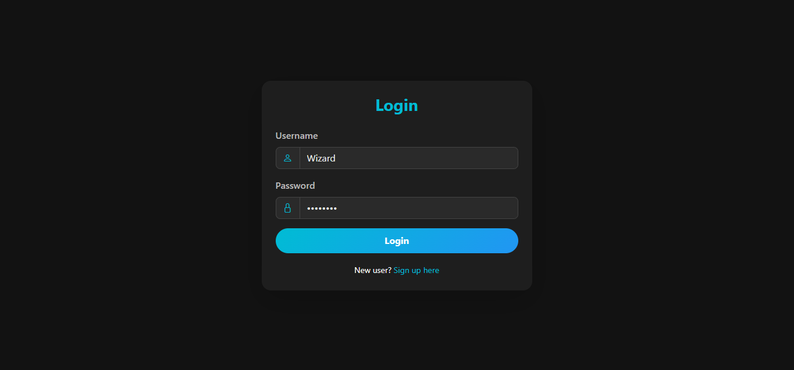
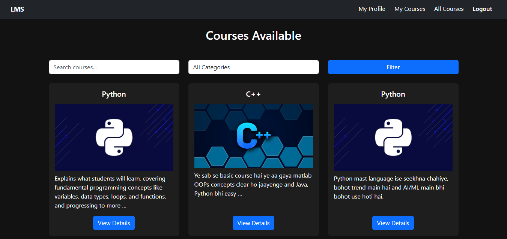
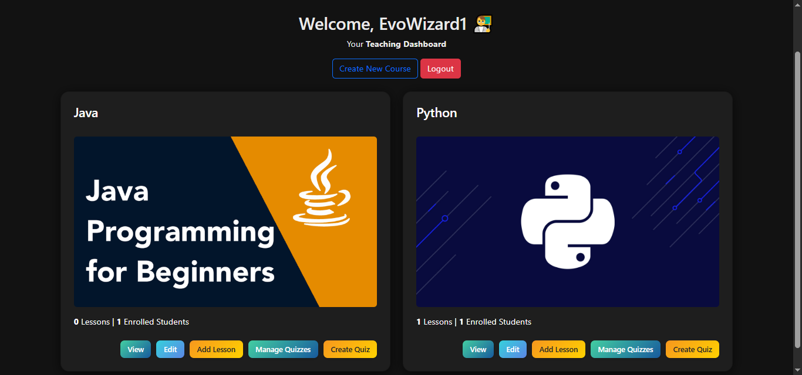
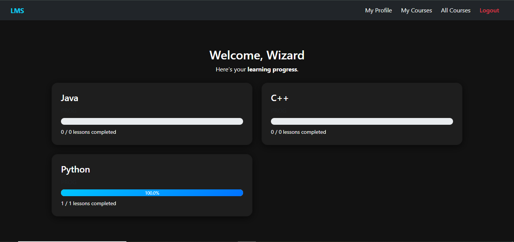

# 📘 Learning Management System (LMS)


---

## 🧩 Overview

A full-featured **Learning Management System (LMS)** built with **Django** and **PostgreSQL**, enabling teachers to create courses and quizzes while students can enroll, learn through video lessons, track progress, and take assessments.

This project demonstrates **complete backend + frontend integration**, **role-based authentication**, and **scalable data management** — designed with clarity and modern UI.

---

## 🚀 Features

### 👨‍🏫 For Teachers
- Create, edit, and delete courses  
- Upload lessons with videos and resources  
- Create and manage quizzes  
- View student progress reports  

### 👩‍🎓 For Students
- Register, log in, and browse available courses  
- Enroll and access lessons with progress tracking  
- Attempt quizzes and get instant graded results  
- View dashboard with course progress  

---

## ⚙️ Core System Highlights
- Role-based authentication (Admin, Teacher, Student)  
- Dark-themed responsive UI  
- Secure session management  
- Lesson-based progress tracking  
- PostgreSQL database integration  
- Media upload for videos and thumbnails  

---

## 🛠️ Tech Stack

| Layer | Technology |
|-------|-------------|
| **Backend** | Django, Python |
| **Database** | PostgreSQL |
| **Frontend** | HTML, CSS, Bootstrap |
| **Auth & Security** | Django Auth System |
| **Storage** | Local (configurable to AWS S3) |

---

## 📁 Project Structure

```bash
LMS/
│
├── users/                # Authentication, roles, dashboards
├── courses/              # Course and lesson management
├── quizzes/              # Quiz and assessment module
├── templates/            # HTML templates
├── static/               # CSS, JS, static assets
├── media/                # Uploaded thumbnails & videos
│
├── manage.py             # Django management script
└── requirements.txt      # Dependencies


## ⚡ Setup Instructions

# 1️⃣ Clone the repository
git clone https://github.com/TusharPanchal55/lms.git
cd LMS

# 2️⃣ Create virtual environment & activate
python -m venv venv
source venv/bin/activate      # macOS/Linux
venv\Scripts\activate         # Windows

# 3️⃣ Install dependencies
pip install -r requirements.txt

# 4️⃣ Setup PostgreSQL and run migrations
python manage.py makemigrations
python manage.py migrate

# 5️⃣ Create admin account
python manage.py createsuperuser

# 6️⃣ Run the server
python manage.py runserver


🔗 Access the App:

🌐 App: http://127.0.0.1:8000/

<<<<<<< HEAD
🖼️ Screenshots
=======
🔐 Admin: http://127.0.0.1:8000/admin/

## 🖼️ Screenshots


🎓 Student Dashboard
>>>>>>> 4965eb310eca4a60ebe44f7a91d40d0241e765b3

| Section | Preview |
|----------|----------|
| 📝 SignUp Page |  |
| 🔐 Login Page |  |
| 🏠 Courses |  |
| 👨‍🏫 Teacher Dashboard |  |
| 👩‍🎓 Student Dashboard |  |


🎯 Future Enhancements

🪪 Certificate generation upon course completion

💬 Discussion forum for learners

🤖 Recommendation engine for personalized learning paths

📊 Advanced analytics dashboard for instructors

🧠 Key Learnings

Implemented Role-Based Access Control (RBAC) in Django

Designed reusable models and views for scalability

Built dynamic progress tracking and relational data management

Understood real-world LMS architecture and workflows

🧑‍💻 Author

Developed by: Tushar Panchal

💼 Feel free to connect for collaboration or feedback.

📜 License

This project is licensed under the MIT License — free for personal and commercial use.